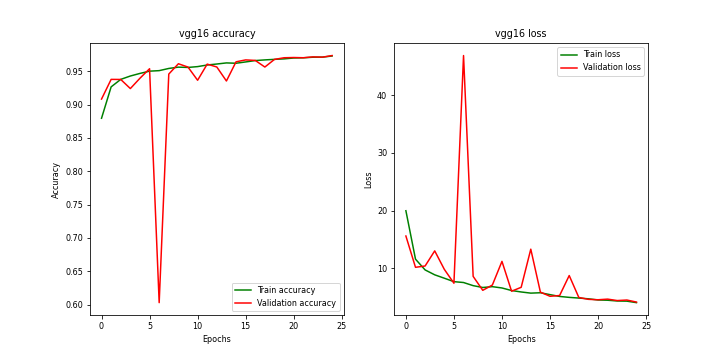
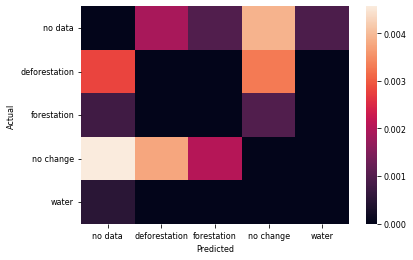

# Forestry-Accounting

The project was created as final project in 2023 by Daniil Onishchenko.

## Models and architectures

### Architectures

There are totally two architectures that was used in the project:
<ul>
    <li><a href="https://arxiv.org/abs/1505.04597">U-Net</a></li>
    <li><a href="https://arxiv.org/abs/1707.03718">LinkNet</a></li>
</ul>

### Backbones (encoders)

There are totally 3 different encoders:

<ul>
    <li><a href="https://arxiv.org/abs/1409.1556">Vgg16</a></li>
    <li><a href="https://arxiv.org/abs/1512.03385">ResNet18</a></li>
    <li><a href="https://arxiv.org/abs/1905.11946">EfficientNetB0</a></li>
</ul>

## Results

As the result of the project user-friendly easy-to-use (and another nouns-to-adjectives) GUI application with Artificial Intelligence components was created. Six networks were created, trained and tested:

### VGG16 U-Net





### VGG16 LinkNet


### ResNet18 U-Net


### ResNet18 LinkNet


### EfficientNetB0 U-Net


### EfficientNetB0 LinkNet


## How to run scripts

There are a couple of easy-to-use scripts for developments process. For example image cropping, dataset generation, model training, etc. 

### classify.py

Takes two Landsat folders and generates six files:

<ul>
    <li>ndvi1.TIF - NDVI map from first Landsat folder;</li>
    <li>ndvi_classification1.TIF - approximated classification of first Landsat folder based on NDVI (see below for details);</li>
    <li>ndvi2.TIF - NDVI map from second Landsat folder;</li>
    <li>ndvi_classification2.TIF - approximated classification of second Landsat folder based on NDVI (see below for details);</li>
    <li>classes.TIF - deforestation classes (each pixel is 5d vector);</li>
    <li>dmap.TIF - actual deforestation map based on classes.TIF.</li>
</ul>

This script adjust and crops images accordingly to coordinates in both files.

Usage:

```shell
python classify.py -fip "PATH_TO_LANDSAT_FOLDER" -sip "PATH_TO_LANDSAT_FOLDER" -op "PATH_TO_OUTPUT_FOLDER" 
```

###  dataset.py

Generates an actual dataset from `classify.py` output. In output folder two sub-directories will be created: `x_data` and `y_data`. Both will contain the same numbers of images. Shapes will be (N, 64, 64, 2) and (N, 64, 64, 1) respectively.

Usage:
```shell
python dataset.py -ip "PATH_TO_CLASSIFY.PY_OUTPUT" -op "OUTPUT"
```

### train.py

This script allows model creation and training with a lot of different callbacks and logging. To use the script different set of parameters are essential to specify:
<table>
    <tr>
        <td>Param</td>
        <td>Short form</td>
        <td>Required</td>
        <td>Description</td>
    </tr>
    <tr>
        <td>--x-data</td>
        <td>-xd</td>
        <td>✅</td>
        <td>Path to x_data directory</td>
    </tr>
    <tr>
        <td>--y-data</td>
        <td>-yd</td>
        <td>✅</td>
        <td>Path to y_data directory</td>
    </tr>
    <tr>
        <td>--x-data-t</td>
        <td>-xdt</td>
        <td>✅</td>
        <td>Path to x_data directory (for test)</td>
    </tr>
    <tr>
        <td>--y-data-t</td>
        <td>-ydt</td>
        <td>✅</td>
        <td>Path to y_data directory (for test)</td>
    </tr>
    <tr>
        <td>--backbone</td>
        <td></td>
        <td>✅</td>
        <td>
            Specifies type of encoder. Available encoders are: 
                    'vgg16', 'vgg19', 
                    'resnet18', 'resnet34', 'resnet50', 'resnet101', 'resnet152',
                    'seresnet18', 
                    'efficientnetb0', 'efficientnetb1', 'efficientnetb2'
        </td>
    </tr>
    <tr>
        <td>--epochs</td>
        <td>-e</td>
        <td></td>
        <td>Specifies number of epochs. Default is 25</td>
    </tr>
    <tr>
        <td>--architecture</td>
        <td>-a</td>
        <td></td>
        <td>Specifies type of the architecture of the model. Available architectures are: unet, linknet</td>
    </tr>
</table>

Usage:

```shell
python train.py -xd "x_data/" -yd "y_data/" -xdt "data2/x_data/" -ydt "data2/y_data/" --backbone vgg16 -a linknet
```

Important notice: train dataset is used totally for training purpose. Test dataset is split into test (80%) and validation (20%) dataset. ModelCheckpoint, EarlyStopping and ReduceLROnPlateau is used so output directory will contain trained models and training process may be stopped earlier. After training `OUTPUT` directory will also contain `.csv` file with history, `ARCHITECTURE-BACKBONE.png` file with loss (+val_loss) and accuracy (+val_accuracy) graphs and confusion matrix of the model without central picks.
